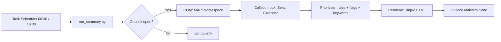

# Outlook Daily Briefing

A Windows-only helper that scans your open Outlook at 8:30 AM and 4:30 PM, prioritises what matters, and emails you a concise report. It reviews Inbox, Sent Items, and Calendar, applies configurable rules to rank and group emails, and flags overdue items from the past month.

## Why this exists

Email triage can be noisy and time-consuming. This tool was built to:

- Surface critical messages from customers, VIPs, and important domains
- Separate staff-managed customers from your direct customers
- Remind you about flagged or unread emails that are more than a month old
- Combine today's key emails with today's calendar so you can act quickly
- Work with your already open Outlook session, no complicated APIs

## Features

- Twice-daily briefings at 08:30 and 16:30, Monday to Friday
- Priority rules by domain, sender, keywords, importance, and follow-up flags
- Grouping for specific client sets, for example "Jason's clients"
- Overdue watchdog for flagged or unread items older than 30 days, marked as critical if from priority contacts
- Calendar snapshot for today, plus optional look-ahead
- Report delivery via Outlook, sent to your own address
- Local configuration in a simple JSON or YAML file
- Runs only if Outlook is already open

## Technology

**Languages:** Python 3.10+

**Libraries:**
- pywin32 for Outlook COM automation
- python-dateutil, tzlocal for robust date handling
- PyYAML or built-in json for configuration
- jinja2 for HTML report templating
- Optional: rich for readable console output during testing

**Platform:** Windows 10 or 11 with Microsoft Outlook for Windows that supports COM automation

**Scheduling:** Windows Task Scheduler

## Repository structure

```
outlook-daily-briefing/
├─ src/
│  ├─ briefing/
│  │  ├─ outlook_client.py
│  │  ├─ collector.py
│  │  ├─ prioritiser.py
│  │  ├─ renderer.py
│  │  └─ scheduler_guard.py
│  └─ run_summary.py
├─ config/
│  ├─ config.template.yaml
│  └─ rules.example.json
├─ templates/
│  └─ report.html.j2
├─ docs/
│  ├─ images/
│  │  ├─ sample-report.png
│  │  └─ architecture-diagram.png
│  └─ samples/
│     └─ example-summary.html
├─ requirements.txt
├─ LICENSE
└─ README.md
```

## Setup

### 1) Prerequisites

- Windows 10 or 11
- Microsoft Outlook for Windows open in your user session when the task runs
- Python 3.10+ installed and on PATH

### 2) Install dependencies

```bash
# From the repository root
python -m venv .venv
.venv\Scripts\activate
pip install -r requirements.txt

# If needed for some environments
python -m pip install pywin32
```

**requirements.txt:**

```
pywin32>=306
python-dateutil>=2.9
tzlocal>=5.2
PyYAML>=6.0
jinja2>=3.1
rich>=13.7
```

### 3) Configure rules

Copy the template and edit:

```bash
copy config\config.template.yaml config\config.yaml
```

**Sample config.yaml:**

```yaml
report:
  to: "you@yourcompany.com"
  subject_template: "Daily Outlook Briefing - {{ timestamp_local }}"
  include_sections:
    - high_priority
    - customers_direct
    - customers_team
    - internal
    - calendar_today
    - overdue_month
  max_items_per_section: 20
  preview_html: "docs/samples/example-summary.html"   # optional

behaviour:
  only_when_outlook_open: true
  lookback_days_inbox: 2
  overdue_days: 30

priorities:
  vip_domains:
    - "keycustomer.com"
    - "board.example"
  vip_senders:
    - "ceo@yourcompany.com"
    - "cfo@yourcompany.com"
  ignore_domains:
    - "newsletter.example"
    - "noreply.example"
  downrank_domains:         # orders that are handled by group inbox
    - "orders.example"
  group_mappings:           # group certain customers to staff owners
    "globallubricant.com": "Jason's Clients"

  keyword_rules:
    - pattern: "(?i)\\burgent\\b|\\bASAP\\b|\\bimmediate\\b"
      priority: critical
      suggest: "Reply today"
    - pattern: "(?i)\\binvoice\\b|\\bpayment\\b"
      priority: high
      suggest: "Review and respond"
    - pattern: "(?i)\\bmeeting\\b|\\bcalendar\\b|\\binvite\\b"
      priority: high
      suggest: "Confirm or propose time"

calendar:
  include_today: true
  include_tomorrow_first_meeting: true
```

## Usage

### Run once for testing

```bash
.venv\Scripts\activate
python src\run_summary.py --config config\config.yaml --dry-run
```

`--dry-run` prints the summary to console and writes `docs/samples/example-summary.html` if configured

Omit `--dry-run` to send the email through Outlook

### Typical commands

```bash
# Send morning briefing now
python src\run_summary.py --mode morning --config config\config.yaml

# Send evening briefing now
python src\run_summary.py --mode evening --config config\config.yaml

# Limit to new or unread items since yesterday
python src\run_summary.py --since 1d --config config\config.yaml
```

### What the script does

1. Attaches to the already running Outlook instance
2. Collects items from Inbox, Sent Items, Calendar
3. Classifies emails using your rules, flags, sender domains, and importance
4. Builds an HTML report and emails it to you via Outlook

### Example code snippets

Connect only if Outlook is open:

```python
import sys, pythoncom
import win32com.client

try:
    outlook = win32com.client.GetActiveObject("Outlook.Application")
except pythoncom.com_error:
    sys.exit(0)  # Outlook not open, exit quietly

namespace = outlook.GetNamespace("MAPI")
inbox = namespace.GetDefaultFolder(6)       # Inbox
sent = namespace.GetDefaultFolder(5)        # Sent Items
calendar = namespace.GetDefaultFolder(9)    # Calendar
```

Send the report through Outlook:

```python
mail = outlook.CreateItem(0)   # 0 = MailItem
mail.To = config["report"]["to"]
mail.Subject = render_subject()
mail.HTMLBody = render_html_summary(items)
mail.Send()
```

## Scheduling with Windows Task Scheduler

Create two scheduled tasks that run under your Windows account.

### GUI steps

1. Open Task Scheduler
2. Create Task
3. Triggers:
   - Daily, 08:30, repeat on weekdays
   - Daily, 16:30, repeat on weekdays
4. Action:
   - Program: `C:\Path\To\python.exe`
   - Arguments: `C:\repo\outlook-daily-briefing\src\run_summary.py --mode morning --config C:\repo\...\config.yaml`
   - and similarly for `--mode evening`
5. Conditions:
   - Start only if you are logged on
6. General:
   - Run with highest privileges if needed

### Command line alternative

```bash
schtasks /create /tn "OutlookDailyBriefing_AM" /tr "\"C:\Python311\python.exe\" \"C:\repo\outlook-daily-briefing\src\run_summary.py\" --mode morning --config \"C:\repo\outlook-daily-briefing\config\config.yaml\"" /sc WEEKLY /d MON,TUE,WED,THU,FRI /st 08:30

schtasks /create /tn "OutlookDailyBriefing_PM" /tr "\"C:\Python311\python.exe\" \"C:\repo\outlook-daily-briefing\src\run_summary.py\" --mode evening --config \"C:\repo\outlook-daily-briefing\config\config.yaml\"" /sc WEEKLY /d MON,TUE,WED,THU,FRI /st 16:30
```

Ensure Outlook is open in your user session at those times.

## Screenshots and diagrams

### Architecture



### Sample report


## Roadmap

- [ ] Optional GUI for rule editing
- [ ] Per-sender SLA reminders
- [ ] Smarter suggestions based on message content
- [ ] Attachment digests and link safety checks
- [ ] Export to Teams message or local dashboard
- [ ] Support for multiple Outlook profiles
- [ ] Unit tests and integration tests

## License

Released under the MIT License. See [LICENSE](LICENSE) file for details.

## Credits

- **Concept and product direction:** Mark Anderson
- **Engineering and documentation:** Contributors listed in Git history
- **Third-party libraries:** pywin32, python-dateutil, tzlocal, jinja2, PyYAML, rich

## References and useful docs

- [Outlook Object Model Reference](https://learn.microsoft.com/office/vba/api/overview/outlook/object-model)
- [Outlook Items.Restrict filter syntax](https://learn.microsoft.com/office/vba/api/outlook.items.restrict)
- [MailItem properties](https://learn.microsoft.com/office/vba/api/outlook.mailitem)
- [pywin32 docs](https://pywin32.readthedocs.io)
- [Task Scheduler basics](https://learn.microsoft.com/windows/win32/taskschd/task-scheduler-start-page)

## Security and privacy

- Runs locally on your Windows machine
- Uses your open Outlook session
- Sends the summary to your own address by default
- No cloud services required
- You control all priority rules and grouping in a local config file

## Troubleshooting

**Nothing happens at run time**
Check that Outlook is open in your session. The tool exits quietly if Outlook is not running.

**No COM access**
Ensure you are using Outlook for Windows that supports COM automation. If your organisation has security prompts for programmatic access, speak to IT about trusted access for this tool.

**Too many items flagged as high priority**
Tune `keyword_rules`, `vip_domains`, and `ignore_domains` in config.yaml.

**Report is too long**
Reduce `max_items_per_section` or narrow `lookback_days_inbox`.

## Known Issues and Bug Fixes

### Issue: "Error converting mail item: <unknown>.ReceivedTime"

**Symptom:** Script shows error during email collection but continues to run:
```
briefing.collector - ERROR - Error converting mail item: <unknown>.ReceivedTime
```

**Root Cause:** Some emails in Outlook (drafts, meeting requests, corrupted items, or items with malformed timestamps) cannot have their ReceivedTime property accessed properly through COM automation.

**Impact:** 
- The script continues to work and processes other emails normally
- One or more problematic emails are skipped during processing
- Final report is still generated successfully

**Current Workarounds:**
1. **Use shorter time periods** to avoid problematic emails:
   ```bash
   python "src\run_summary.py" --config "config\config.yaml" --dry-run --mode morning --since 6h
   ```

2. **Clean up Outlook** by moving drafts to proper folders or deleting corrupted items

**Planned Fix:** 
- Add proper exception handling in `collector.py` to gracefully skip problematic emails
- Log which specific email caused the issue for easier identification
- Implement fallback timestamp handling for edge cases

**Technical Details:**
- Error occurs in `briefing/collector.py` line 123 when accessing `item.ReceivedTime`
- This is a COM automation limitation when dealing with certain Outlook item types
- The script's error handling allows it to continue processing despite this issue

## Contributing

Issues and pull requests are welcome. Please include clear reproduction steps and proposed changes. Use British English in documentation and commit messages where practical.